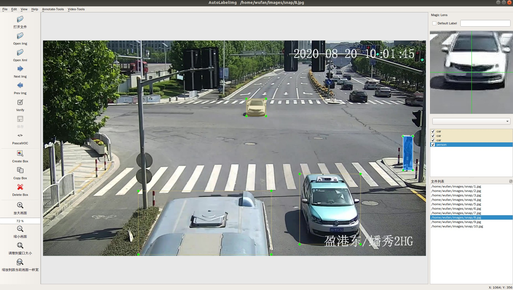

# AutoLabelImg：MultiFunction AutoAnnotate Tools



### [<u>English</u>](./readme.md)    |    [<u>中文</u>](./readme_CN.md)

### Introduction：

Based on [labelImg](https://github.com/tzutalin/labelImg), we add many useful annotate tools, in **Annoatate-tools** and **Video-tools** menu, including：

- **`TOOL LIST`**：
- [x] **Auto Annotate**：anto annotate images using yolov5 detector
- [x] **Tracking Annotate**：using tracking method in opencv, annotate video data
- [x] **Magnifing Lens**：helpful when annotating small objects, optional function
- [x] **Data Agument**：data agument
- [x] **Search System**：search details info based on your input
- [x] other tools：label selecting/rename/counting, fix annotation, video merge/extract, welcome to try


### Update log：

2022-08-29: Updated to support the latest version of the yolov5 model

2022.01.14：remove Retinanet( matain yolov5 only), and add label selecting when autolabeling

2022.01.11：imporve magnifing lens, more fluent and can be shut

2020.12.28：add video tracking annotate

2020.12.10：autolabelimg，version 1.0

## Installation：

1. clone this repo：

   ```bash
   git clone https://github.com/yuchen02/AutoLabelImg
   cd AutoLabelImg
   ```

2. install requirments：

   ```bash
   conda create -n {your_env_name} python=3.7.6
   conda activate {your_env_name}
   pip install -r requirements.txt
   ```

3. compile source code：

   **Ubuntu User:**
   
   ```
   sudo apt-get install pyqt5-dev-tools
   make qt5py3
   ```
   
   **Windows User:**
   
   ```
   pyrcc5 -o libs/resources.py resources.qrc
   ```
   
4. prepare yolov5 weights file and move them to here: [official model zoo:[Yolov5](https://github.com/ultralytics/yolov5)]

   ```bash
   mv {your_model_weight.pt} pytorch_yolov5/weights/
   ```

5. open labelimg software

   ```
   python labelImg.py
   ```

## Set shortcut to open software[optional]

**Windows User:**

create a file:labelImg.bat, open it and type these text(D disk as an example)：

```bash
D:
cd D:{path to your labelImg folder}
start python labelImg.py
exit
```

double click labelImg.bat to open the software.

**Ubuntu User:**

open environment setting file: 

```bash
vim ~/.bashrc
```

add this command：

```bash
alias labelimg='cd {path to your labelImg folder} && python labelImg.py
```

source it：

```bash
source ~/.bashrc
```

typing 'labeling' in terminal to open the software.

## Thanks

Updated on the basis of [AutoLabelImg](https://github.com/wufan-tb/AutoLabelImg), the code of the author is very rigorous

